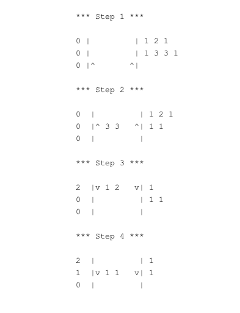

# Лифт в здании

### Тестовое задание на позицию Junior Python Developer в компанию DataOx

## Содержание

- [Задание](#Задание)
- [Условия](#Условия)
- [Нюансы](#Нюансы)
- [Реализация и запуск](#Реализация-и-запуск")

## Задание:

#### Необходимо написать приложение без UI(консольное) или с минимальным UI.

### Условия

* Использовать ООП и придерживаться принципов SOLID, DRY и ETC.

* Здание состоит из **n-ого** количества этажей, где **n** - случайное число генерируемое
  при старте программы в диапазоне `5 <= n <= 20`.

* На каждом этаже **k** количество пассажиров, где k - случайное число генерируемое
  при старте программы в диапазоне `0 <= k <= 10`.

* Каждый пассажир хочет приехать на определённый этаж отличный от того на
  котором он находиться.

* На каждом этаже есть две кнопки для вызова лифта "Вверх" и "Вниз".
  Исключение составляют нижний и верхний этаж.

* Лифт имеет ограничение по вместимости: максимум 5 человек.
  Первый раз лифт загружается людьми с первого этажа, и едет от
  первого(текущего) до наибольшего из тех на которые нужно пассажирам.

* По дороге лифт останавливается на тех этажах на которых нужно пассажирам.
  Высаживает пассажиров и подбирает новых, которым нужно в том же направлении в котором
  движется лифт.

* Также, если лифт загружен не полностью, он может остановиться на этаже
  на котором есть люди и которым необходимо в том же направлении
  (вверх/вниз).
  При посадке новых пассажиров максимальный этаж пересчитывается.

### Пример:

**Здание состоит из 10 этажей.**

<p><b>Шаг 1</b></p>

На первом этаже сели 3 человека:

* 1-му нужно на 2-й этаж;
* 2-му на 4-й этаж;
* 3-му на 6-й этаж;

На данном этапе лифт будет иметь 3-х пассажиров, 2 свободных места и
направление вверх до 6 этажа.

<p><b>Шаг 2</b></p>

Лифт приехал на второй этаж, так как одному из пассажиров
лифта нужно на этот этаж.
Пассажир вышел и в лифте осталось 2 человека, то есть 3 свободных места.
Вышедшему пассажиру назначается новый случайный этаж и
он присоединяется к людям которые ждут лифт.

На втором этаже 5 человек.
Двум из них нужно вверх:

* одному на 7-й этаж,
* другому на 4-й этаж.

Два пассажира садятся в лифт, таким образом в лифте 4 человека и одно свободное
место. Теперь лифт будет иметь направление вверх пока не приедет на 7-й этаж.
(так как новому пассажиру нужно на 7-й этаж)

<p><b>Шаг 3</b></p>
Лифт движется дальше. На третий этаж никому из пассажиров не нужно, но в
лифте есть одно свободное место, а на третьем этаже четверо из семи людей
хотят поехать вверх.

Значит лифт должен остановиться на этаже и подобрать только одного пассажира
из тех, что хотят ехать вверх по тому как лифт имеет только одно свободное место.
Далее лифт движется со всеми необходимыми остановками по уже известному
алгоритму.

Допустим максимальный этаж на который нужно приехать пользователю не
изменился и лифт доехал до 7-го этажа и там высадил всех остающихся в нём
пассажиров. Теперь люди на этаже исходя из большинства выбирают кто сядет в
лифт. Например, на этаже 6 человек хотят ехать вниз и 3 человека вверх. В лифт
сядет 5 из 6 желающих ехать вниз. И лифт двинется вниз по алгоритму
описанному ниже.

### Нюансы

_Старайтесь при написании программы максимально использовать возможности
языка.
Все неоднозначности можно трактовать самостоятельно (например, куда ехать
дальше, если на некотором этаже вышли все, но больше на этом этаже
пассажиров нет).
Для консольной программы вывод сделать покадровый - для каждого
перемещения лифта один кадр.
Пример вывода, необязательно делать именно такой._



## Реализация и запуск

При работе использовались модули из cтандартной библиотеки Python,
а именно **random**, **collections**, **time** и т.д.
Скрипты находятся в папке **src**.

Клонируйте репозиторий

```
git clone https://github.com/joerude/dataox-elevator-test
cd dataox_elevator_test
```

Запустите программу:

`python src/main.py`  

